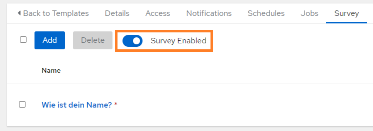

# Webserver Deployment

Als kleines Projekt sollt ihr *automatisiert* einen Webserver in einem Container erstellen.  
Um die Automatisierung auszuführen nutzen wir die *Ansible Automation Platform* (kurz *AAP*), bzw. ihr *Open Source* Pendant *AWX*. Die AAP ist ein Web-UI für die einfache Ausführung von Ansible Automatisierung.

Das Web UI ist erreichbar unter:

<figure markdown>
  <div class="grid cards" markdown>
  [:simple-ansible: &nbsp; http://192.168.178.121:30080](http://192.168.178.121:30080/ "Klick mich!"){ .md-button target=_blank }
  </div>
</figure>

Ihr könnt euch mit eurem **Vornamen** und dem folgenden Standart-Passwort einloggen:

```console
demo123!
```

## 1. Projekt erstellen

In der AAP Oberfläche auf der linken Seite unter *Resources* den Punkt *Projects* wählen.  
Klickt oben auf den Button *Add*, es öffnet sich eine Maske mit Eingabe-Feldern. Ihr müsst lediglich die mit einem roten Sternchen markierten Felder zwingend ausfüllen, alles weitere ist optional.

Gebt eurem Projekt einen Namen, z.B. `QeP Demo`.

Wählt aus der Liste **Source Control Credential Type** den Punkt **Git**, es werden dadurch weitere Felder angezeigt.

Im Feld **Source Control URL** tragt ihr die folgende Adresse ein:

```text
https://github.com/TimGrt/automation-demo
```

!!! tip
    Ihr könnt die Adresse rechts mit einem kleinen Button (*Copy to Clipboard*) kopieren.

Bei den *Checkboxen* unter **Options** wählt ihr **Update Revision on Launch** aus.

Abschließend wählt ihr unten den Button **Save**.

??? info "**Wozu das Ganze?**"
    Ein *Project* in der AAP zeigt auf ein *Repository*, quasi einen (versionskontrollierten) Ordner mit allem *Code* für die Automatisierung.  
    In unserem Fall liegt der gesamte *Code* für die Ansible Automatisierung in einem (öffentlich zugänglichen) *Github* Repository, die AAP zieht sich also den Code aus diesem Ordner und sorgt (durch die Auswahl der Checkbox) dafür, dass vor jeder Ausführung der Automatisierung der aktuellste Stand geladen wird.

## 2. Job Template erstellen

Nachdem der Code für die Automatisierung in der AAP verfügbar ist, wollen wir ihn auch ausführen können. Dazu wird ein *Job Template* erstellt.  

In der AAP Oberfläche auf der linken Seite unter *Resources* den Punkt *Templates* wählen.  
Klickt oben auf den Button *Add* und *Add Job Template*, es öffnet sich eine Maske mit Eingabe-Feldern.

Die folgende Tabelle zeigt alle zu befüllenden Felder:

| Feld                      | Inhalt                 |
| ------------------------- | ---------------------- |
| **Name**                  | `Webserver Deployment` |
| **Job Type**              | `Run`                  |
| **Inventory**             | `QeP Inventory`        |
| **Project**               | `QeP Demo`             |
| **Execution Environment** | `QeP EE`               |
| **Playbook**              | `welcome.yml`          |
| **Credentials**           | `EC2 instance SSH Key` |

Speichert euer Job Template mit dem Button **Save**.

!!! danger "Noch nicht ausführen!"
    Führt das Job Template noch **nicht** aus, wir wollen den Webserver noch personalisieren!

Im nächsten Schritt fügen wir dem Job Template noch ein *Survey* hinzu, eine Abfrage, um eine Variable im Ansible *Code* zu setzen.

??? info "**Wozu das Ganze?**"  
    In einem *Job Template* wird ein Automatisierungs-*Run* festgelegt, damit lässt sich die Automatisierung später ausführen (so oft wir wollen!).  
    Dazu müssen wir festlegen, welchen Code wollen wir ausführen wollen. Wir verweisen also auf das "Project* und wählen daraus ein sogenantes *Playbook* (hier drin steht der wirkliche *Code*). Ebenfalls müssen wir festlegen *wo* wir den Code ausführen wollen, das steht im *Inventory*. Das *Credential* legt fest *wie* wir uns mit dem Zielhost (oder den *vielen* Zielhosts) verbinden, wir müssen uns dort einloggen (*authentifizieren*).
    Als letztes brauchen wir noch eine *Ausführungsumgebung*, ein *Execution Environment*, es beinhaltet alles um den Code ausführen zu können.

## 3. Survey erstellen

Um den Webserver über eine *Variable* zu personalisieren erstellt ihr ein sogenanntes *Survey*, eine interaktive Abfrage, welche beim Start des *Job Templates* aufgerufen wird.  
Falls ihr nicht mehr auf der Übersichtsseite eures Templates seid, wählt aus den *Resources* wieder *Templates* und klickt auf euer erstelltes Job Template. Ein Survey kann in der Menüleiste des Templates ganz rechts hinzugefügt werden.


Klickt im Survey-Tab auf den Button **Add**. In das *Question*-Feld tragt ihr **Wie ist dein Name?** ein, die *Answer variable name* muss den folgenden Inhalt haben:

```console
attendee
```

!!! success "Variablenname korrekt?"
    Nur wenn der Name der Variablen exakt `attendee` lautet, kann die Automatisierung euren Webserver personalisieren.

Speichert das Survey mit dem Button **Save**.

Auf der Survey-Übersichtsseite müsst das die Abfrage noch aktivieren, klickt auf den Slider bis er blau hinterlegt ist:



## 4. Automatisierung ausführen

Alles ist vorbereitet, jetzt kann die Automatisierung ausgeführt werden!  
Wählt aus den *Resources* wieder *Templates* aus. Neben eurem Job Template seht ihr ein kleines Raketen-Symbol (:fontawesome-solid-rocket:), klickt drauf, füllt die Abfrage aus und klickt im *Preview*-Tab auf den **Launch** Button!

Sobald das *Playbook* durchgelaufen ist, solltet ihr im Output-Feld unten die folgende Meldung bekommen:

```json
RUNNING HANDLER [welcome-html-container : Container_info] *****************************************************************************************************************************************************************
ok: [192.168.178.126] => {
    "msg": "Open your browser and input this address >> http://192.168.178.126:8080"
}
```

Falls der Output abgeschnitten ist, wechselt kurz in den Tab *Details* und wieder zurück auf *Output*. Öffnet einen neuen Tab im Browser und tragt die angezeigt Addresse ein (die Adresse wird bei jedem von euch unterschiedlich sein). Ihr könnt auch auf den *Task* selbst klicken, es öffnet sich *Host Details*, dort auf den Tab JSON, hier lässt sich die Adresse mit der Maus markieren und kopieren.
